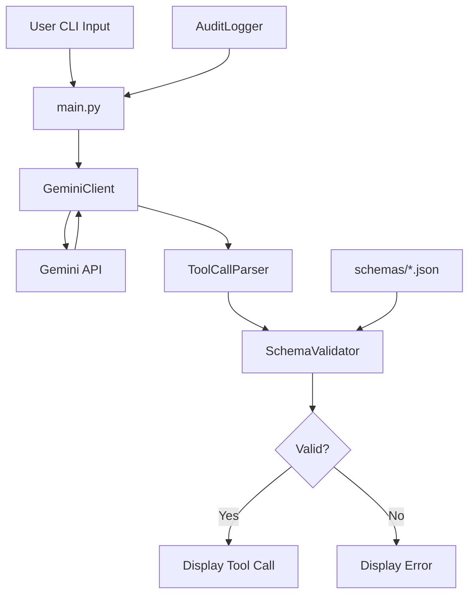

# Phase 1: Core Agent + Gemini CLI - Implementation Plan

## Plan Metadata
| Field | Value |
|---|---|
| Doc Path | `knowledge-vault/plans/phase-1-implementation-plan.md` |
| Status | Active |
| Phase | 1 of 10 |
| Last Edited (YYYY-MM-DD) | 2026-01-16 |
| Last Major Edit (YYYY-MM-DD) | 2026-01-16 |
| Modified By | AI Agent (Claude) |
| WHY (Reason for last change) | Initial Phase 1 implementation plan creation |

---

## Executive Summary

### Phase 1 Goal
Create a CLI tool that:
1. Takes a user prompt
2. Sends it to Gemini API with tool schemas
3. Parses the JSON function_call response
4. Validates against JSON Schema
5. Displays the validated tool call (no execution yet)

### Done Criteria (from Design Doc)
> CLI tool that takes prompt, calls Gemini, parses JSON tool call. Schema validation fails gracefully.

### Key Risk
- Schema validation fails due to Gemini returning unexpected format

---

## Architecture Diagram (Phase 1)



---

## Directory Structure

```
project-root/
├── agent_host/
│   ├── __init__.py
│   ├── main.py              # CLI entrypoint
│   ├── gemini_client.py     # Gemini API wrapper
│   ├── tool_parser.py       # Parse function_call responses
│   ├── schema_validator.py  # JSON Schema validation
│   ├── audit_logger.py      # JSONL audit logging
│   └── config.py            # Configuration management
├── schemas/
│   ├── search_files.json
│   ├── get_metadata.json
│   ├── read_text.json
│   ├── extract_content.json
│   ├── plan_ops.json
│   ├── apply_ops.json
│   ├── open_item.json
│   └── run_automation.json
├── tests/
│   ├── __init__.py
│   ├── unit/
│   │   ├── __init__.py
│   │   ├── test_schema_validator.py
│   │   └── test_tool_parser.py
│   ├── golden/
│   │   ├── __init__.py
│   │   ├── test_golden_files.py
│   │   └── fixtures/
│   │       ├── search_files_001.json
│   │       └── ...
│   └── conftest.py          # pytest fixtures
├── pyproject.toml
├── poetry.lock
├── .gitignore
└── README.md
```

---

## Tool Schemas (JSON Schema Draft-07)

### 1. search_files
```json
{
  "$schema": "http://json-schema.org/draft-07/schema#",
  "$id": "search_files",
  "title": "search_files",
  "description": "Find files based on metadata or content",
  "type": "object",
  "properties": {
    "query": {
      "type": "string",
      "description": "Search query string"
    },
    "path_filter": {
      "type": "string",
      "description": "Optional path filter pattern"
    },
    "limit": {
      "type": "integer",
      "minimum": 1,
      "maximum": 100,
      "default": 10,
      "description": "Maximum number of results"
    }
  },
  "required": ["query"]
}
```

### 2. get_metadata
```json
{
  "$schema": "http://json-schema.org/draft-07/schema#",
  "$id": "get_metadata",
  "title": "get_metadata",
  "description": "Retrieve size, dates, and permissions for paths",
  "type": "object",
  "properties": {
    "paths": {
      "type": "array",
      "items": { "type": "string" },
      "minItems": 1,
      "description": "Array of file paths to get metadata for"
    }
  },
  "required": ["paths"]
}
```

### 3. read_text
```json
{
  "$schema": "http://json-schema.org/draft-07/schema#",
  "$id": "read_text",
  "title": "read_text",
  "description": "Read plain text content from a file",
  "type": "object",
  "properties": {
    "path": {
      "type": "string",
      "description": "Path to the file to read"
    },
    "byte_range": {
      "type": "array",
      "items": { "type": "integer" },
      "minItems": 2,
      "maxItems": 2,
      "description": "Optional [start, end] byte range"
    }
  },
  "required": ["path"]
}
```

### 4. extract_content
```json
{
  "$schema": "http://json-schema.org/draft-07/schema#",
  "$id": "extract_content",
  "title": "extract_content",
  "description": "Extract text from rich formats",
  "type": "object",
  "properties": {
    "path": {
      "type": "string",
      "description": "Path to the file"
    },
    "mode": {
      "type": "string",
      "enum": ["text", "pdf", "code"],
      "description": "Extraction mode"
    }
  },
  "required": ["path", "mode"]
}
```

### 5. plan_ops
```json
{
  "$schema": "http://json-schema.org/draft-07/schema#",
  "$id": "plan_ops",
  "title": "plan_ops",
  "description": "Propose a set of file modifications",
  "type": "object",
  "properties": {
    "ops": {
      "type": "array",
      "items": {
        "type": "object",
        "properties": {
          "op": {
            "type": "string",
            "enum": ["move", "delete", "rename"]
          },
          "src": { "type": "string" },
          "dest": { "type": "string" }
        },
        "required": ["op", "src"],
        "if": {
          "properties": { "op": { "const": "delete" } }
        },
        "then": {},
        "else": {
          "required": ["dest"]
        }
      },
      "minItems": 1,
      "description": "Array of planned operations"
    }
  },
  "required": ["ops"]
}
```

### 6. apply_ops
```json
{
  "$schema": "http://json-schema.org/draft-07/schema#",
  "$id": "apply_ops",
  "title": "apply_ops",
  "description": "Execute a previously planned operation",
  "type": "object",
  "properties": {
    "plan_id": {
      "type": "string",
      "description": "ID of the plan to execute"
    }
  },
  "required": ["plan_id"]
}
```

### 7. open_item
```json
{
  "$schema": "http://json-schema.org/draft-07/schema#",
  "$id": "open_item",
  "title": "open_item",
  "description": "Open a file in the default app or Finder",
  "type": "object",
  "properties": {
    "path": {
      "type": "string",
      "description": "Path to the item to open"
    }
  },
  "required": ["path"]
}
```

### 8. run_automation
```json
{
  "$schema": "http://json-schema.org/draft-07/schema#",
  "$id": "run_automation",
  "title": "run_automation",
  "description": "Execute a predefined AppleScript or Shell script (allowlisted)",
  "type": "object",
  "properties": {
    "name": {
      "type": "string",
      "description": "Name of the predefined automation"
    },
    "inputs": {
      "type": "object",
      "additionalProperties": true,
      "description": "Input parameters for the automation"
    }
  },
  "required": ["name"]
}
```

---

## Implementation Steps

### Step 1: Project Setup
1. Create directory structure
2. Initialize Poetry project (`poetry init`)
3. Add dependencies:
   - `google-generativeai` (Gemini SDK)
   - `jsonschema` (JSON Schema validation)
   - `pytest` (testing)
   - `pytest-cov` (coverage)
   - `ruff` (linting)
   - `mypy` (type checking)
   - `python-dotenv` (environment variables)

### Step 2: Configuration Module (`config.py`)
```python
# config.py outline
import os
from pathlib import Path
from dataclasses import dataclass

@dataclass
class Config:
    gemini_api_key: str
    model_name: str = "gemini-pro"
    schemas_dir: Path = Path("schemas")
    audit_log_path: Path = Path("~/.local/share/ai-agent/audit.log").expanduser()
    max_retries: int = 3
    retry_delay: float = 1.0
```

### Step 3: Gemini Client (`gemini_client.py`)
```python
# gemini_client.py outline
import google.generativeai as genai
from typing import Dict, Any, List

class GeminiClient:
    def __init__(self, api_key: str, model_name: str = "gemini-pro"):
        genai.configure(api_key=api_key)
        self.model = genai.GenerativeModel(model_name)
        
    def send_prompt_with_tools(
        self, 
        prompt: str, 
        tools: List[Dict[str, Any]]
    ) -> Dict[str, Any]:
        """Send prompt with function calling configuration."""
        # Implementation with retry logic
```

### Step 4: Schema Validator (`schema_validator.py`)
```python
# schema_validator.py outline
import json
from pathlib import Path
from jsonschema import validate, ValidationError
from typing import Dict, Any

class SchemaValidator:
    def __init__(self, schemas_dir: Path):
        self.schemas: Dict[str, Dict] = {}
        self._load_schemas(schemas_dir)
        
    def _load_schemas(self, schemas_dir: Path):
        """Load all JSON schemas from directory."""
        
    def validate_tool_call(
        self, 
        tool_name: str, 
        arguments: Dict[str, Any]
    ) -> bool:
        """Validate arguments against tool schema."""
```

### Step 5: Tool Parser (`tool_parser.py`)
```python
# tool_parser.py outline
from typing import Dict, Any, Optional
from dataclasses import dataclass

@dataclass
class ToolCall:
    name: str
    arguments: Dict[str, Any]
    raw_response: Dict[str, Any]

class ToolCallParser:
    def parse_response(
        self, 
        response: Any
    ) -> Optional[ToolCall]:
        """Extract tool call from Gemini response."""
```

### Step 6: Audit Logger (`audit_logger.py`)
```python
# audit_logger.py outline
import json
from pathlib import Path
from datetime import datetime
from typing import Dict, Any

class AuditLogger:
    def __init__(self, log_path: Path):
        self.log_path = log_path
        self._ensure_dir()
        
    def log_event(
        self, 
        event_type: str, 
        data: Dict[str, Any]
    ):
        """Append event to JSONL audit log."""
```

### Step 7: CLI Entrypoint (`main.py`)
```python
# main.py outline
import argparse
import sys
from config import Config
from gemini_client import GeminiClient
from schema_validator import SchemaValidator
from tool_parser import ToolCallParser
from audit_logger import AuditLogger

def main():
    parser = argparse.ArgumentParser(description="AI Agent CLI")
    parser.add_argument("prompt", help="User prompt")
    args = parser.parse_args()
    
    # Initialize components
    config = Config.from_env()
    client = GeminiClient(config.gemini_api_key)
    validator = SchemaValidator(config.schemas_dir)
    parser = ToolCallParser()
    logger = AuditLogger(config.audit_log_path)
    
    # Execute prompt flow
    # ...

if __name__ == "__main__":
    main()
```

---

## Testing Strategy

### Unit Tests
| Test File | Coverage Area | Test Cases |
|---|---|---|
| `test_schema_validator.py` | Schema loading, validation | Valid args, invalid args, missing required, extra fields |
| `test_tool_parser.py` | Response parsing | Valid function_call, no function_call, malformed response |

### Golden Tests
| Test File | Coverage Area | Purpose |
|---|---|---|
| `test_golden_files.py` | End-to-end parsing | Regression testing on known good inputs/outputs |

### Golden File Format
```json
{
  "test_id": "search_files_001",
  "description": "Basic file search query",
  "input": {
    "prompt": "Find all Python files in the Documents folder"
  },
  "expected_tool_call": {
    "name": "search_files",
    "arguments": {
      "query": "Python files",
      "path_filter": "Documents",
      "limit": 10
    }
  },
  "mock_gemini_response": {
    "candidates": [{
      "content": {
        "parts": [{
          "functionCall": {
            "name": "search_files",
            "args": {
              "query": "Python files",
              "path_filter": "Documents",
              "limit": 10
            }
          }
        }]
      }
    }]
  }
}
```

---

## Error Handling

### Error Categories
| Category | Example | Response | User Message |
|---|---|---|---|
| Configuration Error | Missing API key | Exit with code 1 | "GOOGLE_API_KEY not set" |
| API Error | Rate limit | Retry with backoff | "API temporarily unavailable, retrying..." |
| Network Error | Connection failed | Retry with backoff | "Network error, retrying..." |
| Validation Error | Invalid tool args | Display error | "Tool call validation failed: {details}" |
| Parse Error | No function_call | Display info | "No tool call in response" |

### Retry Strategy
- Max retries: 3
- Initial delay: 1 second
- Backoff multiplier: 2
- Max delay: 10 seconds
- Retry on: Rate limit (429), Server error (5xx), Network timeout

---

## Security Considerations

### API Key Management
- Load from `GOOGLE_API_KEY` environment variable
- Never log API key
- Never include in error messages

### Input Validation
- All tool arguments validated against JSON Schema before display
- No code execution in Phase 1

### Audit Logging
- All tool calls logged to JSONL file
- Log format: `{"timestamp": "...", "event": "TOOL_CALL", "tool": "...", "args": {...}}`

---

## Knowledge Vault Update Checklist

After implementation, the following files need documentation in knowledge vault:

### Files to Document
| File | Doc Path |
|---|---|
| `agent_host/__init__.py` | `projects/personal-macos-ai-agent/files/agent_host/__init__.md` |
| `agent_host/main.py` | `projects/personal-macos-ai-agent/files/agent_host/main.md` |
| `agent_host/gemini_client.py` | `projects/personal-macos-ai-agent/files/agent_host/gemini_client.md` |
| `agent_host/tool_parser.py` | `projects/personal-macos-ai-agent/files/agent_host/tool_parser.md` |
| `agent_host/schema_validator.py` | `projects/personal-macos-ai-agent/files/agent_host/schema_validator.md` |
| `agent_host/audit_logger.py` | `projects/personal-macos-ai-agent/files/agent_host/audit_logger.md` |
| `agent_host/config.py` | `projects/personal-macos-ai-agent/files/agent_host/config.md` |
| `schemas/*.json` | `projects/personal-macos-ai-agent/files/schemas/<name>.md` |
| `pyproject.toml` | `projects/personal-macos-ai-agent/files/pyproject_toml.md` |
| `tests/conftest.py` | `projects/personal-macos-ai-agent/files/tests/conftest.md` |
| `.gitignore` | `projects/personal-macos-ai-agent/files/gitignore.md` |

### Indexes to Update
- `change-history-index.md` - Add all new files to Global File Registry
- `PROJECT.md` - Update Phase 1 status and directory manifest

---

## Next Steps (After Phase 1)

Phase 2 will introduce:
- Swift app shell
- Permission management
- Security-Scoped Bookmarks
- IPC between Swift UI and Python agent

---

## Major Edits Log (Append-Only)
| Date | Modified By | WHY | Summary | Impact |
|---|---|---|---|---|
| 2026-01-16 | AI Agent (Claude) | Initial Phase 1 planning | Created detailed implementation plan with schemas, architecture, and tests | High - establishes implementation roadmap |
