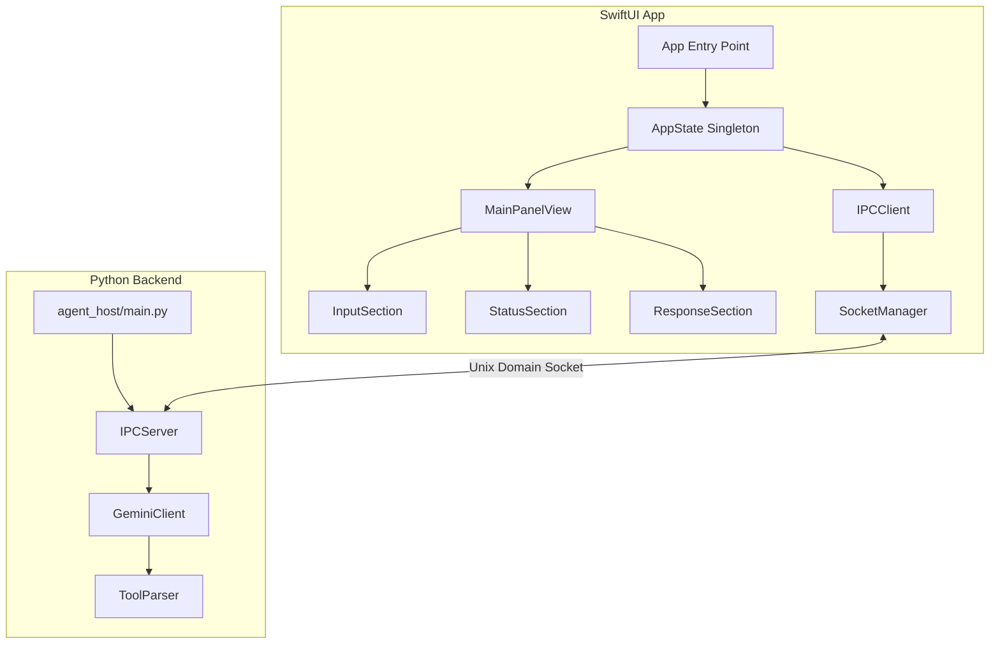

# SwiftUI UI Implementation Plan

## Plan Metadata
| Field | Value |
|---|---|
| Doc Path | `knowledge-vault/plans/swiftui-implementation-plan.md` |
| Status | Active |
| Scope | UI Only (Isolated from Phase 2) |
| Last Edited (YYYY-MM-DD) | 2026-01-18 |
| Last Major Edit (YYYY-MM-DD) | 2026-01-18 |
| Modified By | AI Agent (Codex) |
| WHY (Reason for last change) | Updated test directory layout to match Tests/ structure |

---

## Executive Summary

### Goal
Create an isolated SwiftUI application that:
1. Provides a floating, movable panel with Liquid Glass aesthetic and blue theme
2. Connects to the existing Python agent_host via Unix Domain Socket
3. Shows real-time status updates (thinking, tool calls, etc.)
4. Displays streaming text responses with typewriter animation
5. Toggles visibility with Cmd+K global hotkey

### Scope Boundaries
**IN SCOPE:**
- SwiftUI floating panel UI
- Unix Domain Socket IPC client
- Singleton state management
- Real-time streaming display
- Window behavior (snap, float, toggle)
- Liquid Glass visual design

**OUT OF SCOPE (deferred to future phases):**
- Security-Scoped Bookmarks
- File picker integration
- Permission management
- FSEvents indexing
- Tool execution (UI only displays, backend handles)

---

## Architecture Overview

### System Diagram



### Component Responsibilities

| Component | Responsibility | Pattern |
|---|---|---|
| `AppState` | Global state singleton | ObservableObject Singleton |
| `MainPanelView` | Root view container | SwiftUI View |
| `InputSection` | User input field | SwiftUI View |
| `StatusSection` | Thinking/tool status | SwiftUI View |
| `ResponseSection` | Streaming response display | SwiftUI View |
| `IPCClient` | Socket communication | Actor-based async |
| `SocketManager` | Low-level socket ops | NWConnection |
| `WindowController` | Panel positioning/behavior | NSPanel wrapper |

---

## Folder Structure (Isolated Approach)

```
ui/
├── AIAgentUI.xcodeproj/        # Xcode project file
├── AIAgentUI/
│   ├── App/
│   │   ├── AIAgentUIApp.swift          # @main entry point
│   │   ├── AppDelegate.swift           # NSApplicationDelegate for hotkey
│   │   └── Info.plist                  # App configuration
│   │
│   ├── State/
│   │   ├── AppState.swift              # Singleton observable state
│   │   ├── AgentStatus.swift           # Status enum definitions
│   │   └── Message.swift               # Message model
│   │
│   ├── Views/
│   │   ├── MainPanelView.swift         # Root container view
│   │   ├── Components/
│   │   │   ├── InputField.swift        # Text input component
│   │   │   ├── StatusIndicator.swift   # Thinking/status display
│   │   │   ├── ResponseBubble.swift    # Message bubble component
│   │   │   ├── ToolCallCard.swift      # Tool call display
│   │   │   └── ToggleArrow.swift       # Collapsible section arrow
│   │   └── Styles/
│   │       ├── LiquidGlassStyle.swift  # Glass effect modifiers
│   │       └── BlueTheme.swift         # Color definitions
│   │
│   ├── Window/
│   │   ├── FloatingPanelController.swift   # NSPanel management
│   │   ├── EdgeSnapping.swift              # Edge detection/snapping
│   │   └── GlobalHotkey.swift              # Cmd+K registration
│   │
│   ├── IPC/
│   │   ├── IPCClient.swift             # High-level IPC interface
│   │   ├── SocketManager.swift         # Unix socket connection
│   │   ├── MessageProtocol.swift       # JSON message definitions
│   │   └── StreamingParser.swift       # Incremental response parser
│   │
│   ├── Resources/
│   │   ├── Assets.xcassets             # Images, colors
│   │   └── Localizable.strings         # Localization
│   │
│   └── Preview Content/
│       └── PreviewData.swift           # SwiftUI preview helpers
│
├── Tests/
│   └── AIAgentUITests/
│       ├── StateTests/
│       │   └── AppStateTests.swift
│       ├── IPCTests/
│       │   └── IPCClientTests.swift
│       └── ViewTests/
│           └── MainPanelViewTests.swift
│
└── AIAgentUIUITests/
    └── UIIntegrationTests.swift
```

---

## IPC Architecture (Unix Domain Socket)

### Socket Path
```
/tmp/ai-agent-<pid>.sock
```

The Python backend creates the socket on startup. The Swift UI connects as a client.

### Message Protocol (JSON-RPC 2.0 inspired)

#### Request (Swift → Python)
```json
{
    "jsonrpc": "2.0",
    "id": "uuid-here",
    "method": "prompt",
    "params": {
        "text": "Find all Python files in Documents",
        "stream": true
    }
}
```

#### Status Update (Python → Swift)
```json
{
    "jsonrpc": "2.0",
    "id": "uuid-here",
    "type": "status",
    "status": "thinking",
    "detail": "Analyzing query..."
}
```

#### Streaming Response (Python → Swift)
```json
{
    "jsonrpc": "2.0",
    "id": "uuid-here",
    "type": "stream",
    "delta": "I found ",
    "done": false
}
```

```json
{
    "jsonrpc": "2.0",
    "id": "uuid-here",
    "type": "stream",
    "delta": "15 Python files",
    "done": true
}
```

#### Tool Call (Python → Swift)
```json
{
    "jsonrpc": "2.0",
    "id": "uuid-here",
    "type": "tool_call",
    "tool": {
        "name": "search_files",
        "arguments": {
            "query": "Python files",
            "path_filter": "Documents"
        },
        "status": "pending"
    }
}
```

### Status Enum Values
| Status | Description | UI Indicator |
|---|---|---|
| `idle` | Ready for input | No indicator |
| `connecting` | Connecting to backend | Spinner |
| `thinking` | LLM processing | Pulsing brain icon |
| `calling_tool` | Tool execution | Tool icon + name |
| `streaming` | Receiving response | Typing dots |
| `error` | Error occurred | Red indicator |
| `complete` | Response finished | Checkmark |

---

## Singleton State Management

### AppState.swift
```swift
import SwiftUI
import Combine

@MainActor
final class AppState: ObservableObject {
    // Singleton instance
    static let shared = AppState()
    
    // Published state
    @Published var status: AgentStatus = .idle
    @Published var messages: [Message] = []
    @Published var currentInput: String = ""
    @Published var currentToolCall: ToolCall?
    @Published var isDetailExpanded: Bool = true
    @Published var isPanelVisible: Bool = true
    
    // Streaming response accumulator
    @Published var streamingText: String = ""
    
    // IPC Client
    private let ipcClient: IPCClient
    
    private init() {
        self.ipcClient = IPCClient()
        setupBindings()
    }
    
    func sendPrompt() async {
        guard !currentInput.isEmpty else { return }
        let prompt = currentInput
        currentInput = ""
        status = .thinking
        
        await ipcClient.send(prompt: prompt)
    }
    
    func togglePanel() {
        isPanelVisible.toggle()
    }
}
```

### AgentStatus.swift
```swift
enum AgentStatus: Equatable {
    case idle
    case connecting
    case thinking
    case callingTool(toolName: String)
    case streaming
    case error(message: String)
    case complete
    
    var displayText: String {
        switch self {
        case .idle: return ""
        case .connecting: return "Connecting..."
        case .thinking: return "Thinking..."
        case .callingTool(let name): return "Calling \(name)..."
        case .streaming: return ""
        case .error(let msg): return "Error: \(msg)"
        case .complete: return "Done"
        }
    }
}
```

---

## UI Component Specifications

### Window Specifications
| Property | Value |
|---|---|
| Default Size | 400 x 600 pt |
| Min Size | 300 x 400 pt |
| Max Size | 600 x 800 pt |
| Corner Radius | 20 pt |
| Style | `NSPanel` with `.nonactivatingPanel` |
| Level | `.floating` |
| Background | Translucent (vibrancy material) |

### Visual Design (Liquid Glass + Blue Theme)

#### Color Palette
| Name | Hex | Usage |
|---|---|---|
| `primaryBlue` | `#007AFF` | Buttons, accents |
| `secondaryBlue` | `#5AC8FA` | Highlights, links |
| `darkBlue` | `#0A84FF` | Active states |
| `glassBg` | `rgba(255,255,255,0.7)` | Panel background |
| `glassStroke` | `rgba(255,255,255,0.3)` | Border |
| `textPrimary` | `#1C1C1E` | Main text |
| `textSecondary` | `#8E8E93` | Secondary text |

#### Effect Specifications
```swift
// Liquid Glass Effect
.background(.ultraThinMaterial)
.background(
    LinearGradient(
        colors: [
            Color.white.opacity(0.3),
            Color.white.opacity(0.1)
        ],
        startPoint: .topLeading,
        endPoint: .bottomTrailing
    )
)
.overlay(
    RoundedRectangle(cornerRadius: 20)
        .stroke(Color.white.opacity(0.3), lineWidth: 1)
)
.shadow(color: .black.opacity(0.1), radius: 10, x: 0, y: 5)
```

### Component Layout

```
+------------------------------------------+
|  [≡] AI Agent               [−] [X]      |  <- Title bar (draggable)
+------------------------------------------+
|                                          |
|  ┌────────────────────────────────────┐  |
|  │  🧠 Thinking...                    │  |  <- Status Indicator
|  └────────────────────────────────────┘  |
|                                          |
|  ▼ Tool Call: search_files               |  <- Collapsible tool call
|  ┌────────────────────────────────────┐  |
|  │  query: "Python files"             │  |
|  │  path_filter: "Documents"          │  |
|  └────────────────────────────────────┘  |
|                                          |
|  ┌────────────────────────────────────┐  |
|  │  I found 15 Python files in your   │  |  <- Response area
|  │  Documents folder:                 │  |     (streaming)
|  │  • main.py                         │  |
|  │  • config.py█                      │  |  <- Cursor blink
|  └────────────────────────────────────┘  |
|                                          |
|  ┌────────────────────────────────────┐  |
|  │  Ask me anything...            ↵   │  |  <- Input field
|  └────────────────────────────────────┘  |
|                                          |
+------------------------------------------+
```

---

## Real-Time Streaming Animation

### Typewriter Effect Implementation
```swift
struct TypewriterText: View {
    let text: String
    @State private var displayedText: String = ""
    @State private var showCursor: Bool = true
    
    var body: some View {
        HStack(alignment: .bottom, spacing: 0) {
            Text(displayedText)
                .font(.body)
            
            if showCursor {
                Rectangle()
                    .fill(Color.primaryBlue)
                    .frame(width: 2, height: 16)
                    .opacity(showCursor ? 1 : 0)
                    .animation(.easeInOut(duration: 0.5).repeatForever(), value: showCursor)
            }
        }
        .onChange(of: text) { newValue in
            animateText(to: newValue)
        }
    }
    
    private func animateText(to target: String) {
        // Character-by-character animation
        // Handled by streaming chunks from backend
        displayedText = target
    }
}
```

### Status Indicator Animation
```swift
struct ThinkingIndicator: View {
    @State private var isAnimating = false
    
    var body: some View {
        HStack(spacing: 4) {
            Image(systemName: "brain")
                .foregroundColor(.primaryBlue)
                .scaleEffect(isAnimating ? 1.1 : 1.0)
                .animation(.easeInOut(duration: 0.6).repeatForever(), value: isAnimating)
            
            Text("Thinking...")
                .foregroundColor(.textSecondary)
        }
        .onAppear { isAnimating = true }
    }
}
```

---

## Window Behavior

### Edge Snapping Logic
```swift
class EdgeSnapping {
    static let snapThreshold: CGFloat = 20.0
    
    enum Edge {
        case left, right, top, bottom, none
    }
    
    static func detectNearestEdge(frame: NSRect, screen: NSRect) -> Edge {
        let distanceToLeft = frame.minX
        let distanceToRight = screen.maxX - frame.maxX
        let distanceToTop = screen.maxY - frame.maxY
        let distanceToBottom = frame.minY
        
        let minDistance = min(distanceToLeft, distanceToRight, distanceToTop, distanceToBottom)
        
        if minDistance > snapThreshold { return .none }
        
        switch minDistance {
        case distanceToLeft: return .left
        case distanceToRight: return .right
        case distanceToTop: return .top
        default: return .bottom
        }
    }
    
    static func snapPosition(for edge: Edge, panelSize: NSSize, screen: NSRect) -> NSPoint {
        switch edge {
        case .left:
            return NSPoint(x: screen.minX, y: screen.midY - panelSize.height / 2)
        case .right:
            return NSPoint(x: screen.maxX - panelSize.width, y: screen.midY - panelSize.height / 2)
        case .top:
            return NSPoint(x: screen.midX - panelSize.width / 2, y: screen.maxY - panelSize.height)
        case .bottom:
            return NSPoint(x: screen.midX - panelSize.width / 2, y: screen.minY)
        case .none:
            return .zero // No snapping
        }
    }
}
```

### Global Hotkey Registration
```swift
// In AppDelegate.swift
func applicationDidFinishLaunching(_ notification: Notification) {
    // Register Cmd+K global hotkey
    let hotKey = HotKey(key: .k, modifiers: [.command])
    hotKey.keyDownHandler = { [weak self] in
        self?.togglePanel()
    }
}

func togglePanel() {
    AppState.shared.togglePanel()
    
    if AppState.shared.isPanelVisible {
        FloatingPanelController.shared.show()
    } else {
        FloatingPanelController.shared.hide()
    }
}
```

---

## Python Backend Modifications Required

### New IPC Server Module
A new module needs to be added to `agent_host/` to handle Unix Domain Socket communication:

```
agent_host/
├── ipc/
│   ├── __init__.py
│   ├── server.py           # Socket server
│   ├── protocol.py         # Message definitions
│   └── streaming.py        # Streaming response handler
```

### Server Implementation Outline
```python
# agent_host/ipc/server.py
import asyncio
import json
from pathlib import Path

class IPCServer:
    def __init__(self, socket_path: Path):
        self.socket_path = socket_path
        self.clients = []
        
    async def start(self):
        server = await asyncio.start_unix_server(
            self.handle_client,
            path=str(self.socket_path)
        )
        async with server:
            await server.serve_forever()
    
    async def handle_client(self, reader, writer):
        """Handle incoming client connection."""
        self.clients.append(writer)
        try:
            while True:
                data = await reader.readline()
                if not data:
                    break
                message = json.loads(data.decode())
                await self.process_message(message, writer)
        finally:
            self.clients.remove(writer)
    
    async def process_message(self, message: dict, writer):
        """Process incoming message and send responses."""
        if message.get("method") == "prompt":
            await self.handle_prompt(message, writer)
    
    async def send_status(self, writer, request_id: str, status: str, detail: str = ""):
        """Send status update to client."""
        response = {
            "jsonrpc": "2.0",
            "id": request_id,
            "type": "status",
            "status": status,
            "detail": detail
        }
        writer.write((json.dumps(response) + "\n").encode())
        await writer.drain()
    
    async def send_stream_chunk(self, writer, request_id: str, delta: str, done: bool):
        """Send streaming response chunk."""
        response = {
            "jsonrpc": "2.0",
            "id": request_id,
            "type": "stream",
            "delta": delta,
            "done": done
        }
        writer.write((json.dumps(response) + "\n").encode())
        await writer.drain()
```

---

## Testing Strategy

### Unit Tests
| Test File | What's Tested |
|---|---|
| `AppStateTests.swift` | State mutations, bindings |
| `IPCClientTests.swift` | Message encoding/decoding |
| `EdgeSnappingTests.swift` | Snap detection logic |

### Integration Tests
| Test | Description |
|---|---|
| Socket connection | Connect to mock Python server |
| Message roundtrip | Send request, receive response |
| Streaming | Verify incremental updates |

### UI Tests
| Test | Description |
|---|---|
| Panel toggle | Cmd+K shows/hides panel |
| Input submission | Enter key sends prompt |
| Status display | Status indicator updates correctly |

---

## Implementation Checklist

### Swift UI Tasks
- [ ] Create Xcode project with folder structure
- [ ] Implement AppState singleton
- [ ] Create AgentStatus enum
- [ ] Build MainPanelView
- [ ] Build InputField component
- [ ] Build StatusIndicator component
- [ ] Build ResponseBubble with typewriter
- [ ] Build ToolCallCard component  
- [ ] Build ToggleArrow component
- [ ] Implement LiquidGlassStyle modifier
- [ ] Define BlueTheme colors
- [ ] Implement FloatingPanelController
- [ ] Implement EdgeSnapping logic
- [ ] Register global hotkey (Cmd+K)
- [ ] Implement IPCClient
- [ ] Implement SocketManager
- [ ] Implement MessageProtocol
- [ ] Implement StreamingParser
- [ ] Write unit tests
- [ ] Write UI tests

### Python Backend Tasks
- [ ] Create agent_host/ipc/ module
- [ ] Implement IPCServer
- [ ] Implement protocol.py message types
- [ ] Add streaming response support to GeminiClient
- [ ] Update main.py to start IPC server
- [ ] Write integration tests

---

## Dependencies

### Swift Dependencies (SPM)
| Package | Version | Purpose |
|---|---|---|
| HotKey | ^0.2.0 | Global hotkey registration |
| None required | - | Standard Apple frameworks sufficient |

### Python Dependencies (add to pyproject.toml)
| Package | Version | Purpose |
|---|---|---|
| asyncio | stdlib | Async socket server |
| No new deps | - | Using stdlib only |

---

## Risk Assessment

| Risk | Likelihood | Impact | Mitigation |
|---|---|---|---|
| Socket connection failures | Medium | High | Retry logic, clear error messages |
| Hotkey conflicts | Low | Medium | Allow customization |
| macOS version compatibility | Low | Medium | Target macOS 12+ |
| Performance on large responses | Low | Low | Virtualized list for messages |

---

## Major Edits Log (Append-Only)
| Date | Modified By | WHY | Summary | Impact |
|---|---|---|---|---|
| 2026-01-18 | AI Agent (Claude) | Initial SwiftUI plan | Created comprehensive UI implementation plan | High - establishes UI architecture |
