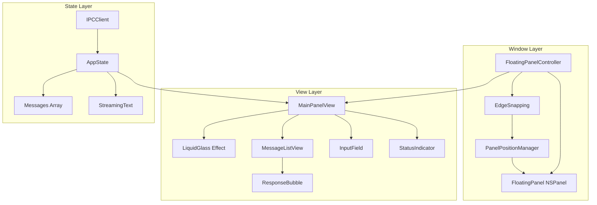
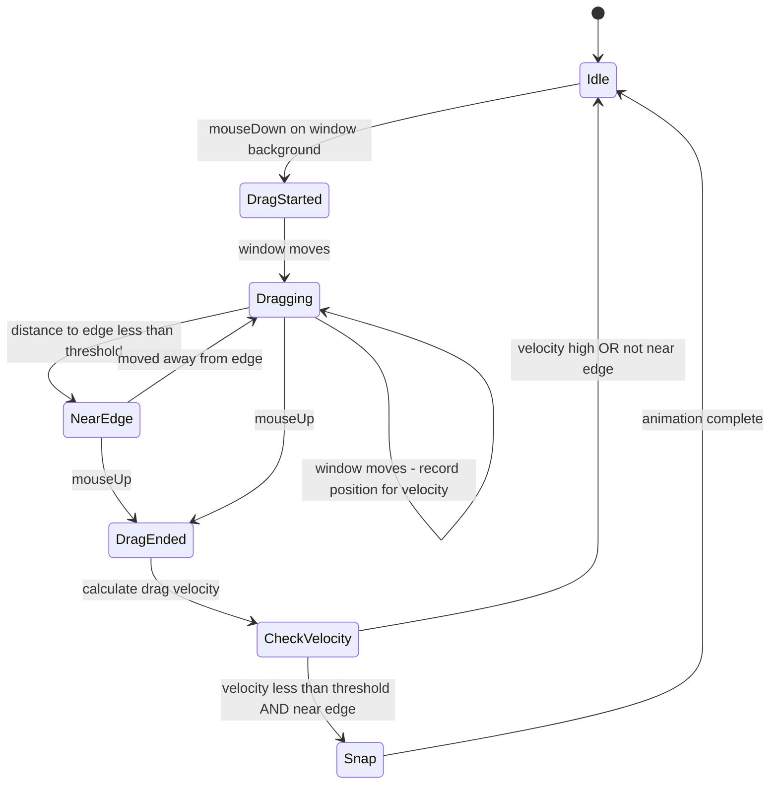

# UI Enhancement Plan: Smoothness, Jitter Reduction, and Performance

## Metadata
| Field | Value |
|---|---|
| Doc Path | `knowledge-vault/plans/ui-enhancement-plan.md` |
| Status | Active |
| Last Edited (YYYY-MM-DD) | 2026-01-18 |
| Last Major Edit (YYYY-MM-DD) | 2026-01-18 |
| Modified By | AI Agent (Codex) |
| WHY (Reason for last change) | Implemented the UI enhancement plan and updated completion status |

---

## Executive Summary

This document outlines a comprehensive plan to enhance the AI Agent floating panel UI focusing on four key areas:
1. **Reducing window jitter** during dragging and edge snapping
2. **Improving animation smoothness** across all interactions
3. **Optimizing response timings** during streaming text updates
4. **General UI/UX improvements** for polish and accessibility

The improvements are based on analysis of the current SwiftUI implementation and Apple's latest SwiftUI documentation via Context7.

---

## Implementation Update (2026-01-18)

**Status:** Implemented across UI, window management, and streaming pipelines.

**Highlights:**
- Snap only on drag end with velocity gating and persisted frame restore
- Standardized animations via `AnimationConstants`
- Streaming updates debounced (~60fps) with streaming-aware scroll behavior
- Glass rendering optimized with `compositingGroup()` and `drawingGroup()`
- Accessibility improvements (labels + reduce motion behavior)

## Current Architecture Overview



---

## Issue Analysis

### 1. Window Jitter Issues

#### Problem: Aggressive Edge Snapping During Drag
**Location:** [`EdgeSnapping.swift:202-227`](ui/AIAgentUI/Window/EdgeSnapping.swift:202)

```swift
// Current problematic code
func panelDidMove(_ panel: NSPanel) {
    guard isSnappingEnabled else { return }
    // ...
    let edge = EdgeSnapping.detectNearestEdge(frame: panel.frame, screen: screen)
    
    if edge != .none && edge != currentEdge {
        // This triggers animation DURING drag!
        NSAnimationContext.runAnimationGroup { context in
            // ...
            panel.animator().setFrameOrigin(snapPosition)
        }
    }
}
```

**Root Cause:** `windowDidMove` NSWindowDelegate callback fires continuously during drag, triggering snap animations that compete with user's mouse movement.

**Solution Design:**

```swift
// Add drag state tracking
@MainActor
final class PanelPositionManager {
    private var isDragging: Bool = false
    private var dragStartPosition: NSPoint?
    private var lastDragVelocity: CGFloat = 0
    
    func panelDidMove(_ panel: NSPanel) {
        guard isSnappingEnabled else { return }
        
        // Track position for velocity calculation but DO NOT SNAP
        if !isDragging {
            isDragging = true
            dragStartPosition = panel.frame.origin
        }
        
        // Visual hint only - no actual movement
        showEdgeProximityIndicator(panel: panel)
    }
    
    func panelDragEnded(_ panel: NSPanel) {
        isDragging = false
        
        // Calculate drag velocity
        let velocity = calculateDragVelocity()
        
        // Only snap for slow releases near edges
        if velocity < snapVelocityThreshold {
            performSnapIfNearEdge(panel: panel)
        }
    }
}
```

#### Problem: No Velocity Consideration
**Impact:** Fast drags that happen to end near an edge incorrectly snap

**Solution:** Add velocity tracking using time-stamped position samples:

```swift
private var positionHistory: [(position: NSPoint, timestamp: TimeInterval)] = []
private let velocityThreshold: CGFloat = 500  // points per second

private func recordPosition(_ position: NSPoint) {
    let now = CACurrentMediaTime()
    positionHistory.append((position, now))
    
    // Keep only last 5 samples - 100ms window
    positionHistory = positionHistory.suffix(5)
}

private func calculateDragVelocity() -> CGFloat {
    guard positionHistory.count >= 2 else { return 0 }
    
    let first = positionHistory.first!
    let last = positionHistory.last!
    let timeDelta = last.timestamp - first.timestamp
    
    guard timeDelta > 0 else { return 0 }
    
    let distance = hypot(
        last.position.x - first.position.x,
        last.position.y - first.position.y
    )
    
    return distance / CGFloat(timeDelta)
}
```

---

### 2. Animation Smoothness Issues

#### Problem: Inconsistent Animation Timing
**Locations:** Multiple files use different timing functions

| File | Current Timing | Duration |
|------|---------------|----------|
| [`FloatingPanelController.swift:127`](ui/AIAgentUI/Window/FloatingPanelController.swift:127) | `.easeOut` | 0.2s |
| [`FloatingPanelController.swift:141`](ui/AIAgentUI/Window/FloatingPanelController.swift:141) | `.easeIn` | 0.15s |
| [`EdgeSnapping.swift:24`](ui/AIAgentUI/Window/EdgeSnapping.swift:24) | `.easeOut` | 0.25s |
| [`ResponseBubble.swift:116`](ui/AIAgentUI/Views/Components/ResponseBubble.swift:116) | `.easeInOut` | 0.5s |

**Solution:** Create centralized animation constants using Apple's new spring animations:

```swift
// Add to BlueTheme.swift
enum AnimationConstants {
    /// Standard spring animation for most interactions
    static let standard = Animation.smooth(duration: 0.3)
    
    /// Quick spring for small UI changes
    static let fast = Animation.smooth(duration: 0.15)
    
    /// Snappy spring for direct manipulation feedback
    static let snappy = Animation.snappy(duration: 0.25)
    
    /// Gentle spring for large transitions
    static let gentle = Animation.smooth(duration: 0.5, extraBounce: 0.1)
    
    // NSAnimationContext equivalent for AppKit
    static func appKitSpring(duration: TimeInterval = 0.3) -> CAMediaTimingFunction {
        // Use system spring curve
        return CAMediaTimingFunction(name: .easeInEaseOut)
    }
}
```

#### Problem: Show/Hide Could Be Smoother
**Current:** Simple alpha fade
**Better:** Combine scale + alpha for more polished feel

```swift
// Enhanced show animation
func show() {
    guard let panel = panel else { return }
    
    if !isVisible {
        panel.alphaValue = 0
        
        // Start slightly smaller and below
        let currentFrame = panel.frame
        let startFrame = NSRect(
            x: currentFrame.origin.x,
            y: currentFrame.origin.y - 10,
            width: currentFrame.width * 0.98,
            height: currentFrame.height * 0.98
        )
        panel.setFrame(startFrame, display: false)
        panel.makeKeyAndOrderFront(nil)
        
        NSAnimationContext.runAnimationGroup { context in
            context.duration = 0.25
            context.timingFunction = CAMediaTimingFunction(name: .easeOut)
            context.allowsImplicitAnimation = true
            
            panel.animator().alphaValue = 1
            panel.animator().setFrame(currentFrame, display: true)
        }
    }
    
    isVisible = true
}
```

---

### 3. Response Timing Issues

#### Problem: Excessive State Updates During Streaming
**Location:** [`AppState.swift:110-115`](ui/AIAgentUI/State/AppState.swift:110)

```swift
// Current: Updates on EVERY character
ipcClient.$streamingText
    .receive(on: DispatchQueue.main)
    .sink { [weak self] text in
        self?.updateStreamingMessage(with: text)  // Triggers view redraw
    }
```

**Solution:** Add batched updates with debouncing:

```swift
// Add debouncing publisher
private var streamingDebouncer: AnyCancellable?

private func setupStreamingDebounce() {
    streamingDebouncer = ipcClient.$streamingText
        .debounce(for: .milliseconds(16), scheduler: DispatchQueue.main)  // ~60fps
        .removeDuplicates()
        .sink { [weak self] text in
            self?.updateStreamingMessage(with: text)
        }
}
```

#### Problem: ScrollView Jumps During Streaming
**Location:** [`ResponseBubble.swift:256-261`](ui/AIAgentUI/Views/Components/ResponseBubble.swift:256)

```swift
// Current: Animated scroll on every content change
.onChange(of: messages.last?.content) { _ in
    scrollToBottom()  // This causes jumpy behavior during fast streaming
}

private func scrollToBottom() {
    withAnimation(.easeOut(duration: 0.2)) {  // Animation may not complete
        scrollProxy?.scrollTo(lastMessage.id, anchor: .bottom)
    }
}
```

**Solution:** Disable animation during streaming, use smooth anchoring:

```swift
// Check if currently streaming
private var isStreaming: Bool {
    messages.last?.isStreaming == true
}

private func scrollToBottom() {
    guard let lastMessage = messages.last else { return }
    
    if isStreaming {
        // Immediate scroll without animation during streaming
        scrollProxy?.scrollTo(lastMessage.id, anchor: .bottom)
    } else {
        // Smooth animated scroll when not streaming
        withAnimation(.smooth(duration: 0.25)) {
            scrollProxy?.scrollTo(lastMessage.id, anchor: .bottom)
        }
    }
}
```

#### Problem: Glass Effect Performance
**Location:** [`LiquidGlassStyle.swift:40-57`](ui/AIAgentUI/Views/Styles/LiquidGlassStyle.swift:40)

**Solution:** Add `compositingGroup()` to flatten expensive effects:

```swift
func body(content: Content) -> some View {
    content
        .background(material)
        .background(LinearGradient.glassGradient)
        .compositingGroup()  // ADD: Flatten layers before effects
        .clipShape(RoundedRectangle(cornerRadius: cornerRadius))
        .overlay(
            RoundedRectangle(cornerRadius: cornerRadius)
                .stroke(Color.glassStroke, lineWidth: showBorder ? 1 : 0)
        )
        .shadow(/* ... */)
}
```

For complex views like the panel itself, consider `drawingGroup()`:

```swift
// In MainPanelView, wrap the entire content
.drawingGroup(opaque: false, colorMode: .nonLinear)
```

---

### 4. Other UI/UX Improvements

#### Dark Mode Support
**Current:** Light theme only with hardcoded colors

**Solution:** Add adaptive colors:

```swift
extension Color {
    // Replace hardcoded colors with adaptive versions
    static let adaptiveTextPrimary: Color = {
        Color(NSColor.labelColor)
    }()
    
    static let adaptiveCardBackground: Color = {
        Color(NSColor.controlBackgroundColor)
    }()
    
    static let adaptiveGlassBg: Color = {
        if NSApp.effectiveAppearance.name == .darkAqua {
            return Color.black.opacity(0.7)
        } else {
            return Color.white.opacity(0.7)
        }
    }()
}
```

#### Persist Window Position
**Solution:** Save/restore position in UserDefaults:

```swift
extension PanelPositionManager {
    private static let positionKey = "panelPosition"
    private static let sizeKey = "panelSize"
    
    func savePosition(_ panel: NSPanel) {
        let frame = panel.frame
        UserDefaults.standard.set(
            NSStringFromRect(frame),
            forKey: Self.positionKey
        )
    }
    
    func restorePosition(_ panel: NSPanel) {
        if let frameString = UserDefaults.standard.string(forKey: Self.positionKey),
           let frame = NSRectFromString(frameString) as NSRect? {
            panel.setFrame(frame, display: false)
        }
    }
}
```

#### Accessibility Improvements

```swift
// Add to ResponseBubble
.accessibilityElement(children: .combine)
.accessibilityLabel("Message from \(roleLabel): \(message.content)")
.accessibilityHint(message.isStreaming ? "Message is still loading" : nil)

// Add reduced motion support
@Environment(\.accessibilityReduceMotion) var reduceMotion

private func animatedScroll() {
    if reduceMotion {
        scrollProxy?.scrollTo(lastMessage.id, anchor: .bottom)
    } else {
        withAnimation(.smooth) {
            scrollProxy?.scrollTo(lastMessage.id, anchor: .bottom)
        }
    }
}
```

---

## Implementation Priority

### Critical (Must Fix)
| # | Issue | Files Affected | Complexity |
|---|-------|----------------|------------|
| 1 | Edge snap only on drag end | `EdgeSnapping.swift`, `FloatingPanelController.swift` | Medium |
| 2 | Debounce streaming updates | `AppState.swift` | Low |
| 3 | Disable scroll animation during streaming | `ResponseBubble.swift` | Low |

### High Priority
| # | Issue | Files Affected | Complexity |
|---|-------|----------------|------------|
| 4 | Standardize spring animations | `BlueTheme.swift`, all view files | Medium |
| 5 | Add compositingGroup to glass | `LiquidGlassStyle.swift` | Low |
| 6 | Improve show/hide with scale | `FloatingPanelController.swift` | Low |
| 7 | Track isDragging state | `EdgeSnapping.swift` | Medium |

### Medium Priority
| # | Issue | Files Affected | Complexity |
|---|-------|----------------|------------|
| 8 | Add drag velocity for snapping | `EdgeSnapping.swift` | Medium |
| 9 | Persist window position | `PanelPositionManager`, `FloatingPanelController.swift` | Low |
| 10 | Dark mode colors | `BlueTheme.swift` | Medium |
| 11 | Cmd+Enter shortcut | `InputField.swift` | Low |

### Low Priority
| # | Issue | Files Affected | Complexity |
|---|-------|----------------|------------|
| 12 | Accessibility labels | All component files | Low |
| 13 | Reduced motion support | Animation.swift, views | Medium |
| 14 | Loading shimmer placeholder | New file | Medium |

---

## Architecture Diagram: Improved Drag Handling



---

## Files to Modify

1. **`ui/AIAgentUI/Window/EdgeSnapping.swift`** - Major changes to drag handling
2. **`ui/AIAgentUI/Window/FloatingPanelController.swift`** - Delegate improvements, show/hide animation
3. **`ui/AIAgentUI/State/AppState.swift`** - Debouncing for streaming
4. **`ui/AIAgentUI/Views/Components/ResponseBubble.swift`** - Scroll behavior
5. **`ui/AIAgentUI/Views/Styles/LiquidGlassStyle.swift`** - compositingGroup
6. **`ui/AIAgentUI/Views/Styles/BlueTheme.swift`** - Animation constants, adaptive colors
7. **`ui/AIAgentUI/Views/Components/InputField.swift`** - Keyboard shortcuts

---

## Success Criteria

After implementation:

1. **Jitter Test:** Drag window slowly near screen edges - no animation should occur until release
2. **Fast Drag Test:** Quick flick past an edge should NOT snap
3. **Streaming Test:** Text streaming should not cause visible scroll jumps
4. **Animation Test:** All animations should feel consistent and use spring physics
5. **Dark Mode Test:** UI should be legible in both light and dark mode
6. **Restart Test:** Window position should persist across app restarts

---

## Major Edits Log (Append-Only)

| Date | Modified By | WHY | Summary | Impact |
|---|---|---|---|---|
| 2026-01-18 | AI Agent (Claude) | Initial creation | Complete UI enhancement plan with code examples | High |
| 2026-01-18 | AI Agent (Codex) | Implementation completion | Executed plan items across window, animation, streaming, and accessibility | High |
