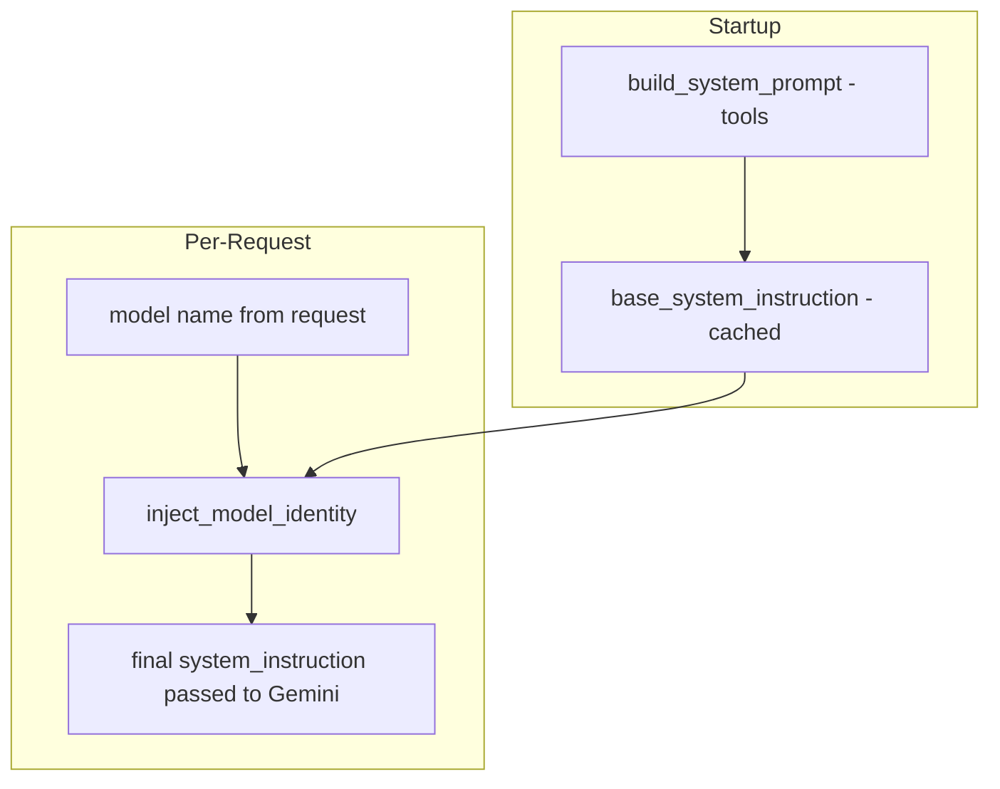
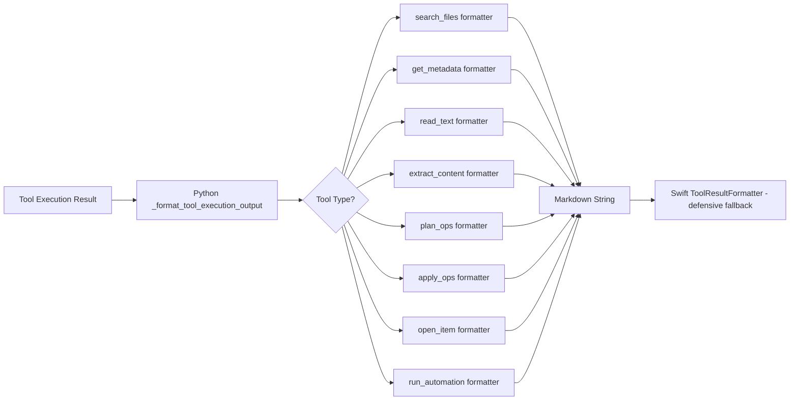
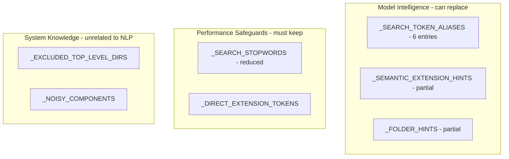
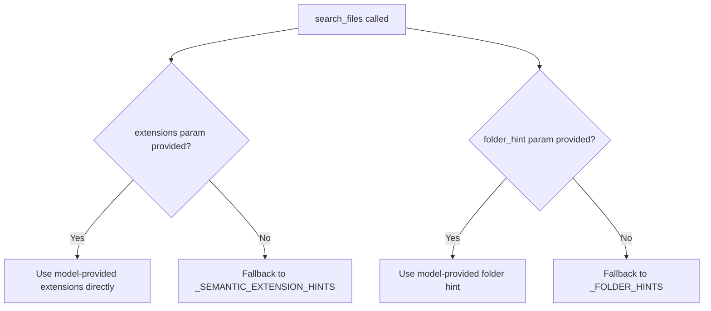
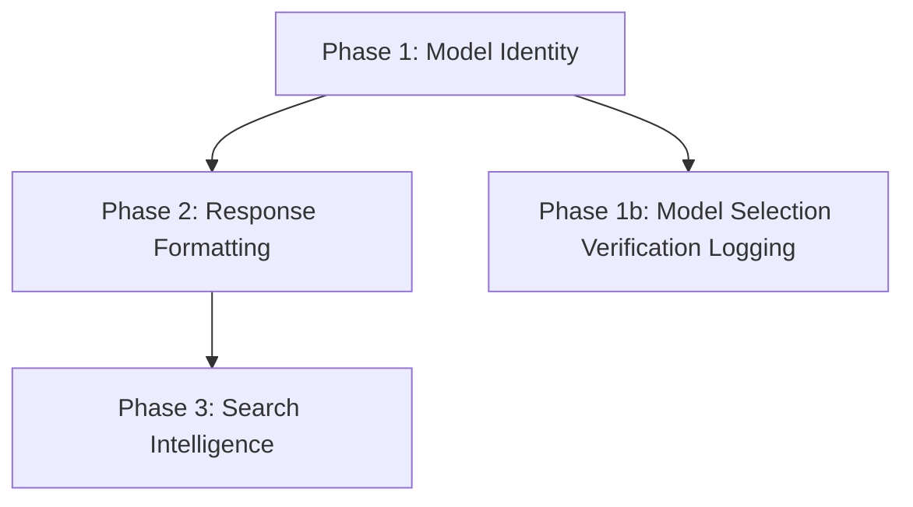

# UX & Architecture Fix Plan

## Overview

This plan addresses four interrelated issues affecting user experience and backend architecture:

1. **Model Selection Verification** — Confirm per-request model switching works end-to-end
2. **Model Self-Identity** — Inject model name into system prompt so models know which variant they are
3. **Response Formatting** — Format all tool outputs as clean markdown (not just `search_files`)
4. **Search Intelligence** — Shift NLP intelligence from hardcoded word lists to model-driven structured parameters

---

## Issue 1: Model Selection — Per-Request Switching

### Analysis

The full flow has been traced and **model switching already works correctly per-request**:


- [`AppState.swift`](ui/AIAgentUI/State/AppState.swift:562): Captures `selectedModel` before sending
- [`MessageProtocol.swift`](ui/AIAgentUI/IPC/MessageProtocol.swift:40): `PromptParams.model` included in JSON
- [`main.py`](agent_host/main.py:1084): `model = request.params.get("model")` extracted from request
- [`gemini_client.py`](agent_host/gemini_client.py:188): `model_name = model or self.model_name` — per-request override
- [`gemini_client.py`](agent_host/gemini_client.py:270): `self._client.models.generate_content(model=model_name)` — no client restart needed

### Verdict

**No code changes needed for model switching itself.** The `genai.Client` supports per-request model selection. The only issue is that the **system prompt is built once at startup** ([`main.py:429`](agent_host/main.py:429)), which blocks model identity injection. This is fixed by Issue 2.

### Verification Task

Add a backend log line that captures the actual model used in the API response metadata, confirming the Gemini API honored the per-request model override.

---

## Issue 2: Model Self-Identity in System Prompt

### Problem

The system prompt in [`system-prompt-v1.md`](knowledge-vault/plans/system-prompt-v1.md) says *You are an autonomous personal assistant for macOS* but never mentions which Gemini model variant is running. When users ask *which model are you?*, the model has no truthful answer.

### Root Cause

- [`build_system_prompt(tools)`](agent_host/system_prompt.py:133) is called **once at startup** ([`main.py:430`](agent_host/main.py:430))
- The same `system_instruction` string is reused for every request
- No model name is injected anywhere

### Design — Two-Tier System Prompt

Build the base prompt once at startup for performance. Inject model identity per-request via lightweight string prepend.



**Performance**: This is a single `f-string` prepend per request — negligible cost.

### Changes Required

| File | Change |
|------|--------|
| [`system_prompt.py`](agent_host/system_prompt.py) | Add `inject_model_identity(base_prompt, model_name)` function |
| [`main.py`](agent_host/main.py:430) | Rename startup variable to `base_system_instruction` |
| [`main.py`](agent_host/main.py:678) | Call `inject_model_identity()` per-request before passing to Gemini |
| [`system-prompt-v1.md`](knowledge-vault/plans/system-prompt-v1.md) | Add `{model_identity}` placeholder to SYSTEM IDENTITY section |

### inject_model_identity Design

```python
def inject_model_identity(base_prompt: str, model_name: str) -> str:
    identity_block = (
        f"## MODEL IDENTITY\n\n"
        f"You are currently running as **{model_name}**.\n"
        f"When asked which model or version you are, respond truthfully with this identifier.\n"
        f"Do not guess or fabricate model names.\n"
    )
    return f"{identity_block}\n\n{base_prompt}"
```

---

## Issue 3: Response Formatting for All Tool Types

### Problem

Only `search_files` has proper markdown formatting. All other tools dump raw JSON to the user.

**Backend** ([`main.py:194`](agent_host/main.py:194)):
```python
# Non-search_files tools fall through to this:
payload = json.dumps(execution, ensure_ascii=False)
```

**Frontend** ([`ToolResultFormatter.swift:15`](ui/AIAgentUI/State/ToolResultFormatter.swift:15)):
```swift
guard let rendered = renderSearchFiles(payload: payload) else {
    return content  // Raw JSON fallback for everything else
}
```

### Design — Dual-Layer Formatting

Format markdown primarily in the **Python backend** (`_format_tool_execution_output`). The Swift **frontend** `ToolResultFormatter` acts as a defensive fallback for any raw JSON that slips through.



### Formatting Specs Per Tool

#### `get_metadata`
```markdown
**File Metadata** for 2 path(s):

| Property | Value |
|----------|-------|
| Path | ~/Documents/report.pdf |
| Exists | Yes |
| Type | File |
| Size | 2.4 MB |
| Created | 2026-02-01 14:30 |
| Modified | 2026-02-07 09:15 |
| Permissions | 0o644 |
```

#### `read_text`
````markdown
**File Content**: `~/Documents/notes.md` (bytes 0–1024 of 2048)

```
[file content here]
```
````

#### `extract_content`
````markdown
**Extracted Content** (mode: code): `~/src/app.py`
Lines: 142

```python
[content here]
```
````

#### `plan_ops`
```markdown
**Operation Plan** `plan-abc123def456`

| # | Op | Source | Destination | Valid |
|---|-----|--------|-------------|-------|
| 1 | move | ~/Desktop/old.txt | ~/Documents/old.txt | ✅ |
| 2 | delete | ~/Desktop/temp.log | — | ✅ |

Issues: none
```

#### `apply_ops`
```markdown
**Operations Applied** — plan `plan-abc123def456`
Applied: 2 | Failed: 0

1. ✅ **move** `~/Desktop/old.txt` → `~/Documents/old.txt`
2. ✅ **delete** `~/Desktop/temp.log` (moved to Trash)
```

#### `open_item`
```markdown
✅ Opened `~/Documents/report.pdf`
```

#### `run_automation`
````markdown
**Automation**: `cleanup.sh` — Exit code: 0 ✅

**stdout**:
```
Cleaned 14 files, freed 230MB
```
````

### Changes Required

| File | Change |
|------|--------|
| [`main.py`](agent_host/main.py:103) | Refactor `_format_tool_execution_output()` into per-tool formatters |
| [`ToolResultFormatter.swift`](ui/AIAgentUI/State/ToolResultFormatter.swift) | Add fallback renderers for all tool types |
| [`ToolResultFormatterTests.swift`](ui/Tests/AIAgentUITests/StateTests/ToolResultFormatterTests.swift) | Add test cases for new tool formatters |

### Refactor: Extract to Dedicated Module

The `_format_tool_execution_output()` function should be extracted from `main.py` into a new `agent_host/response_formatter.py` module. This separates formatting concerns from the server lifecycle.

---

## Issue 4: Hardcoded Word Lists → Model-Driven Search Intelligence

### Problem

[`executor.py`](agent_host/tools/executor.py) contains ~240 lines of hardcoded dictionaries for search NLP:

| List | Lines | Entries | Purpose |
|------|-------|---------|---------|
| `_SEARCH_STOPWORDS` | 42–151 | ~110 | Filter common English words from queries |
| `_SEARCH_TOKEN_ALIASES` | 152–159 | 6 | Synonym mapping |
| `_SEMANTIC_EXTENSION_HINTS` | 160–184 | ~25 | Natural language → file extension mapping |
| `_DIRECT_EXTENSION_TOKENS` | 185–225 | ~35 | Recognize bare extension names |
| `_FOLDER_HINTS` | 226–241 | ~14 | Natural language → folder name mapping |

### Analysis — What Can the Model Replace?



### Design — Hybrid Model + Fallback Strategy

**Core idea**: Enhance `search_files` schema with structured parameters so the model provides search hints directly. Keep reduced word lists as defensive fallback only.

#### Step 1: Enhance search_files Schema

Add optional structured parameters to [`schemas/search_files.json`](schemas/search_files.json):

```json
{
  "extensions": {
    "type": "array",
    "items": { "type": "string" },
    "description": "File extensions to filter for, without dots. Example: pdf, py, jpg"
  },
  "folder_hint": {
    "type": "string",
    "description": "Known folder name to prioritize. Example: downloads, documents, desktop"
  }
}
```

#### Step 2: Update System Prompt with Search Guidance

Add a section to the system prompt teaching the model how to use structured search params:

```markdown
## SEARCH TOOL BEST PRACTICES

When calling search_files, always translate user intent into structured parameters:
- Use `extensions` to specify file types: e.g., user says 'photos' → extensions: [jpg, jpeg, heic, png]
- Use `folder_hint` for known locations: e.g., user says 'in my downloads' → folder_hint: downloads
- Use `path_filter` for path substring matching
- The `query` field should contain the specific filename or content search term, NOT the full natural language request
```

#### Step 3: Update Executor to Prefer Structured Params



#### Step 4: Reduce Word Lists

| List | Action | Before | After |
|------|--------|--------|-------|
| `_SEARCH_STOPWORDS` | **Reduce** to ~50 essential words | ~110 | ~50 |
| `_SEARCH_TOKEN_ALIASES` | **Remove entirely** — model handles synonyms via structured params | 6 | 0 |
| `_SEMANTIC_EXTENSION_HINTS` | **Keep as fallback** — only activates when model omits `extensions` | ~25 | ~25 |
| `_DIRECT_EXTENSION_TOKENS` | **Keep** — needed for scoring engine | ~35 | ~35 |
| `_FOLDER_HINTS` | **Keep as fallback** — only activates when model omits `folder_hint` | ~14 | ~14 |

### Changes Required

| File | Change |
|------|--------|
| [`schemas/search_files.json`](schemas/search_files.json) | Add `extensions` and `folder_hint` optional params |
| [`executor.py`](agent_host/tools/executor.py:42) | Reduce `_SEARCH_STOPWORDS`, remove `_SEARCH_TOKEN_ALIASES` |
| [`executor.py`](agent_host/tools/executor.py:1635) | Update `_search_files()` to use structured params when provided |
| [`system_prompt.py`](agent_host/system_prompt.py:72) | Update `format_tool_belt()` with search guidance |
| [`system-prompt-v1.md`](knowledge-vault/plans/system-prompt-v1.md) | Add SEARCH TOOL BEST PRACTICES section |

---

## Implementation Order

The changes should be implemented in this order to minimize risk and enable incremental testing:



### Phase 1: Model Identity Injection
- [ ] Add `inject_model_identity()` to `system_prompt.py`
- [ ] Update `main.py` to use two-tier system prompt — base cached at startup, model identity injected per-request
- [ ] Update `system-prompt-v1.md` with MODEL IDENTITY placeholder
- [ ] Add verification logging for model name in API response
- [ ] Add unit tests for `inject_model_identity()`

### Phase 2: Response Formatting
- [ ] Create `agent_host/response_formatter.py` — extract formatting logic from `main.py`
- [ ] Add `_format_get_metadata()` formatter
- [ ] Add `_format_read_text()` formatter
- [ ] Add `_format_extract_content()` formatter
- [ ] Add `_format_plan_ops()` formatter
- [ ] Add `_format_apply_ops()` formatter
- [ ] Add `_format_open_item()` formatter
- [ ] Add `_format_run_automation()` formatter
- [ ] Update `main.py` to use the new `response_formatter` module
- [ ] Update `ToolResultFormatter.swift` with fallback renderers for all tools
- [ ] Add Python unit tests for each formatter
- [ ] Add Swift unit tests for each fallback renderer

### Phase 3: Search Intelligence
- [ ] Add `extensions` and `folder_hint` params to `schemas/search_files.json`
- [ ] Update `executor.py::_search_files()` to accept and prefer structured params
- [ ] Reduce `_SEARCH_STOPWORDS` to ~50 essential entries
- [ ] Remove `_SEARCH_TOKEN_ALIASES` dictionary
- [ ] Make `_SEMANTIC_EXTENSION_HINTS` and `_FOLDER_HINTS` activate only as fallback
- [ ] Add SEARCH TOOL BEST PRACTICES section to system prompt
- [ ] Update `format_tool_belt()` in `system_prompt.py` to highlight structured search params
- [ ] Add unit tests for structured param handling in `_search_files()`
- [ ] Integration test: verify model uses structured params in practice

---

## Files Changed Summary

| File | Phase | Type |
|------|-------|------|
| `agent_host/system_prompt.py` | 1 | Modified — add `inject_model_identity()` |
| `agent_host/main.py` | 1, 2 | Modified — per-request prompt, use `response_formatter` |
| `knowledge-vault/plans/system-prompt-v1.md` | 1, 3 | Modified — model identity, search guidance |
| `agent_host/response_formatter.py` | 2 | **New** — all tool output formatters |
| `ui/AIAgentUI/State/ToolResultFormatter.swift` | 2 | Modified — add all tool fallback renderers |
| `schemas/search_files.json` | 3 | Modified — add structured params |
| `agent_host/tools/executor.py` | 3 | Modified — reduce word lists, accept structured params |
| `tests/unit/test_system_prompt.py` | 1 | New — identity injection tests |
| `tests/unit/test_response_formatter.py` | 2 | New — formatter tests |
| `ui/Tests/AIAgentUITests/StateTests/ToolResultFormatterTests.swift` | 2 | Modified — new test cases |
| `tests/unit/test_executor_structured_search.py` | 3 | New — structured search tests |

---

## Risk Assessment

| Risk | Mitigation |
|------|------------|
| System prompt size increase slows API responses | MODEL IDENTITY block is ~50 chars — negligible |
| Removing `_SEARCH_TOKEN_ALIASES` degrades search quality | Model now provides explicit extension/folder hints; aliases only handled 6 trivial synonyms |
| Backend formatters produce broken markdown | Unit tests for each formatter with golden output validation |
| Swift fallback renderers disagree with Python formatters | Python is primary formatter; Swift only activates for raw JSON edge cases |
| Model ignores structured search params | `_SEMANTIC_EXTENSION_HINTS` and `_FOLDER_HINTS` remain as automatic fallback |
